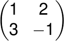

# Smiles


## Usage

This library uses [Chunky PNG](http://chunkypng.com/) to write PNG files.
```
gem install chunky_png
```

The main script is called `smile.rb` and is located in `lib/`. It takes four command-line arguments,
which correspond to the four entries in the transformation matrix. So to generate a smiley face
transformed by the matrix



Run
```
ruby lib/smile.rb 1 2 3 -1
```

It will accept anything that can be converted to a floating point number by Ruby's `to_f` method, so
```
ruby lib/smile.rb 0.5 0.5 -0.5 0.5
```
is also valid.

There are several other scripts in `lib/`, some of which take additional parameters. For instance,
`with_dots.rb` takes six parameters - the first four plus two additional, also numbers. If you
play around with it, you can probably figure out what they're for.

Have fun!

##Tests

Running the tests will require `RSpec` and `RSpec Core`
```
gem install rspec rspec-core
```

Specs can be run with
```
rspec spec
```
